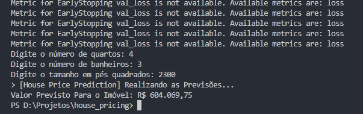

# House Price Predictor
Este é um projeto de exemplo que demonstra como criar um modelo de previsão de preços de imóveis usando Node.js e TensorFlow.js. O modelo é treinado com base em um conjunto de dados de preços de imóveis e é capaz de fazer previsões de preços com base no número de quartos, banheiros e tamanho em pés quadrados de um imóvel.

# Pré-requisitos
Certifique-se de ter as seguintes dependências instaladas antes de executar o projeto:

- Node.js (versão 10 ou superior)
- TensorFlow.js (instalado através do npm ou yarn)

# Instalação
Siga as etapas abaixo para configurar o projeto:

1- Clone este repositório para o seu ambiente local.

2- Navegue até o diretório raiz do projeto.

3- Execute o comando `npm install` ou `yarn install` para instalar as dependências necessárias.

# Uso
Siga as etapas abaixo para executar o programa e fazer previsões de preços de imóveis:

- Certifique-se de ter um arquivo CSV válido com os dados de treinamento. 
- Você pode usar seu próprio conjunto de dados ou encontrar um online.
- Coloque o arquivo CSV no diretório raiz do projeto e certifique-se de que esteja formatado corretamente, com as colunas <strong> bedrooms, bathrooms, sqft_living e price </strong>.
- No terminal, execute o comando node `index.js` para iniciar o programa.
- Siga as instruções no console para fornecer os valores de entrada (número de quartos, número de banheiros e tamanho em pés quadrados) para fazer a previsão de preço.
- O programa fornecerá a previsão de preço com base nos valores de entrada fornecidos.

# Customização
Você pode personalizar o projeto de acordo com suas necessidades. Aqui estão algumas possíveis modificações:

- Arquivo CSV: Substitua o arquivo house_prices.csv pelo seu próprio arquivo de dados de treinamento. Certifique-se de ajustar o código para corresponder às colunas e formatos corretos.
- Arquitetura do modelo: Modifique a arquitetura da rede neural no código createModel() para atender às suas necessidades. Você pode adicionar camadas, ajustar o número de unidades, usar diferentes funções de ativação, etc.
- Hiperparâmetros de treinamento: Personalize os hiperparâmetros de treinamento, como o número de épocas, otimizador, função de perda, etc., no código trainModel() para obter melhores resultados com seu conjunto de dados específico.

# Demonstrativo

